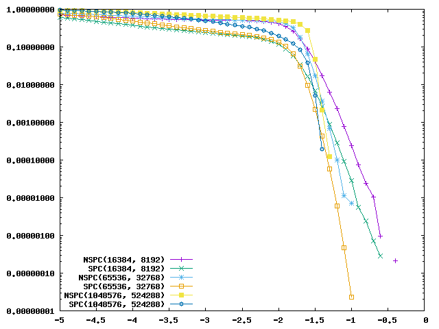

### Playing with successive cancellation decoding of [polar codes](https://en.wikipedia.org/wiki/Polar_code_(coding_theory))

To study polar codes I've started implementing a soft decision decoder using [saturating](https://en.wikipedia.org/wiki/Saturation_arithmetic) [fixed-point](https://en.wikipedia.org/wiki/Fixed-point_arithmetic) operations.

Here some good reads:
* Channel Polarization: A Method for Constructing Capacity-Achieving Codes for Symmetric Binary-Input Memoryless Channels  
by Erdal Arikan - 2009
* On the Rate of Channel Polarization  
by Erdal Arikan and Emre Telatar - 2009
* Systematic Polar Coding  
by Erdal Arikan - 2011
* Fast Polar Decoders: Algorithm and Implementation  
by Gabi Sarkis, Pascal Giard, Alexander Vardy, Claude Thibeault and Warren J. Gross - 2013
* Flexible and Low-Complexity Encoding and Decoding of Systematic Polar Codes  
by Gabi Sarkis, Ido Tal, Pascal Giard, Alexander Vardy, Claude Thibeault and Warren J. Gross - 2015
* A Comparative Study of Polar Code Constructions for the AWGN Channel  
by Harish Vangala, Emanuele Viterbo and Yi Hong - 2015
* [The Flesh of Polar Codes](https://youtu.be/VhyoZSB9g0w)  
by Emre Telatar - ISIT 2017
* [Successive Cancellation List Decoding](https://youtu.be/WbC5Ux5Pjp8)  
by Andrew Thangaraj - NPTEL 2019

### Comparing various systematic and non-systematic rate-1/2 code lengths

